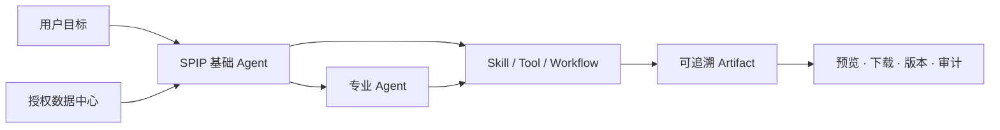

# SPIP

> Smart Project Intelligence Platform — 用长期数据、可配置专业 Agent 和持续 Workspace 完成真实工作。

SPIP 是一个面向个人与团队的智能工作平台。它不是复杂 ERP，也不是单纯聊天机器人：用户把长期资料放入数据中心，在 Workspace 中向系统基础 Agent 提交目标，由基础 Agent 读取当前授权数据、规划任务、调用工具、协调专业 Agent，并交付可预览、可下载、可追溯的文件成果。

## 核心理念

- **一个稳定的基础 Agent**：所有 Workspace 固定由系统基础 Agent 负责问答、规划、协调、验收和交付。
- **可配置专业 Agent**：用户可以安装、复制和配置报销、合同、税务、数据分析、设计等专业 Agent。
- **数据中心是真实事实底座**：Agent 只读取当前组织和 Workspace 已授权的数据，并返回来源证据。
- **成果优先**：真实价值是 Word、Excel、PDF、PPT、图片等可使用文件，不是只输出一段对话。
- **安全与可追溯**：敏感数据外发、高风险写入和正式业务变更需要确认并进入审计。

## 产品结构

| 模块 | 作用 |
|---|---|
| Dashboard | 工作区、近期成果和快速开始 |
| 数据中心 | 文件、目录、解析、版本、授权、检索和来源 |
| 我的 Agent | 专业 Agent、Skill 和 Tool 的配置、调试与发布 |
| 市场 | 发现和安装 Agent、Skill、Tool |
| Workspace | 长期任务时间线、多 Agent 协作、附件、记忆和成果交付 |
| 系统后台 | 邀请码、用户与组织、审计和平台治理 |

## 技术栈

- Web：React 18、TypeScript、Vite
- API：FastAPI、SQLAlchemy、Alembic
- Database：PostgreSQL
- Agent Runtime：SPIP Runtime + `AgentHarnessAdapter` 渐进适配层
- 文件成果：受控的 Office/PDF/媒体生成、预览、版本与下载

详细设计见 [系统架构](docs/ARCHITECTURE.md)，部署准备见 [部署说明](docs/DEPLOYMENT.md)。

## 项目状态

当前处于 **V1 收尾和真实验收阶段**。公开仓库先搭建产品说明、架构与开源治理；经过敏感信息审计、Migration 核验、自动测试、真实浏览器闭环和稳定基线冻结后，再发布完整 `v1.0.0` 源代码。

在 `v1.0.0` 正式发布前：

- 本仓库不应被视为可部署发行版；
- 文档中的目标能力不等于全部已经完成；
- 不接受 Mock 成功冒充真实 API、真实模型或真实文件交付成功。

## V1 验收标准

1. 登录、Workspace、消息、附件和刷新恢复稳定。
2. 基础 Agent 能读取已授权数据、规划并协调专业 Agent。
3. 报销 Agent 能基于真实附件和模板生成可重新打开的 XLSX。
4. Word、Excel、PPT、图片和视频成果可在聊天中查看，并可预览、下载和刷新恢复。
5. 邀请注册和最小管理后台完成真实浏览器纵向验收。
6. Migration、备份恢复、敏感信息、权限和错误状态通过上线审计。

## 开源与安全

本项目计划以 [GNU Affero General Public License v3.0](LICENSE) 发布。第三方组件和素材继续遵守各自许可证。

请勿提交真实 API Key、密码、Token、用户文件或生产数据库。发现安全问题请先阅读 [SECURITY.md](SECURITY.md)，不要直接公开漏洞细节。

## 参与项目

V1 正式发布后将开放安装说明、Issue 模板和贡献流程。贡献前请阅读 [CONTRIBUTING.md](CONTRIBUTING.md)。

---

SPIP 的目标很简单：让普通用户利用自己的长期数据和可配置 Agent，稳定完成真实工作，并拿到真正可用的成果。
