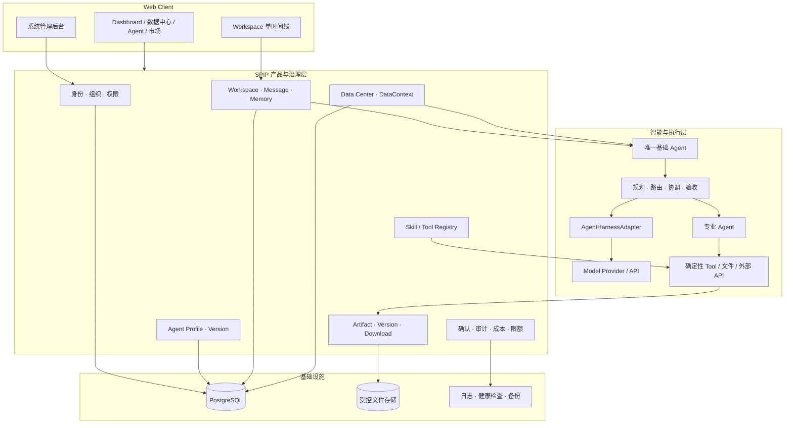
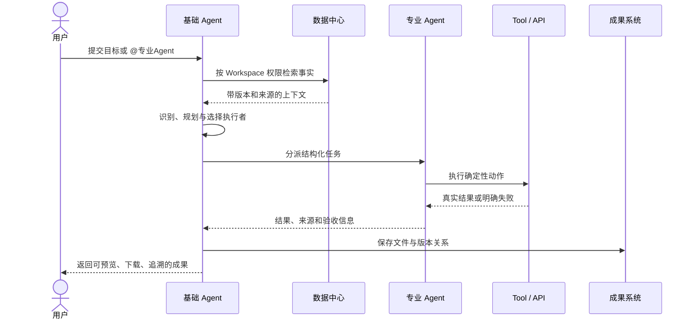

# SPIP 系统架构

本文描述公开且稳定的产品架构。具体实现状态以对应 Release 和验收记录为准。

## 总体架构

## Agent 边界

SPIP 区分三类运行身份：

- `platform_base`：系统唯一基础 Agent。用户不能创建、复制、替换、发布、停用或删除。
- `professional`：用户和市场可配置的专业 Agent，可被用户直接 `@` 或由基础 Agent 调度。
- `internal`：平台内部执行或治理能力，不作为普通市场商品。

基础 Agent 的能力来自大模型基础智力，以及 SPIP 提供的授权数据、Skill、Tool、Workflow、记忆和治理能力。专业 Agent 负责具体岗位工作，但不能绕过 Workspace 权限和审计。

## 典型任务链

## 数据与记忆边界

- 数据中心保存长期事实文件，按组织、目录、版本和 Workspace 授权动态读取。
- Workspace 临时附件属于当前任务，不自动进入数据中心。
- 用户偏好、Agent 个性和 Workspace 记忆分层保存；业务事实不复制成永久记忆。
- 精确数字、字段和业务查询优先由确定性 Tool 计算，模型负责理解和解释。
- 敏感文件发送给外部模型前必须即时确认。

## Artifact 交付

消息只是交互界面，Artifact 才是文件成果真源。每个成果应记录：

- Workspace、消息、执行 Agent 和模型；
- 文件类型、MIME、扩展名、大小和校验和；
- 父成果、版本号和生成时间；
- ToolCall、AgentRun、来源、确认和失败记录；
- 预览、下载和刷新恢复能力。

## Harness 适配原则

SPIP 不把某个第三方 Agent 框架变成产品数据真源。`AgentHarnessAdapter` 只负责模型循环、Tool Calling、委派、暂停与恢复；用户、Workspace、Agent 版本、数据权限、记忆、Artifact 和审计仍由 SPIP 管理。

候选 Harness 必须通过隔离验证和等价验收后渐进接入，禁止大爆炸替换 Runtime。
