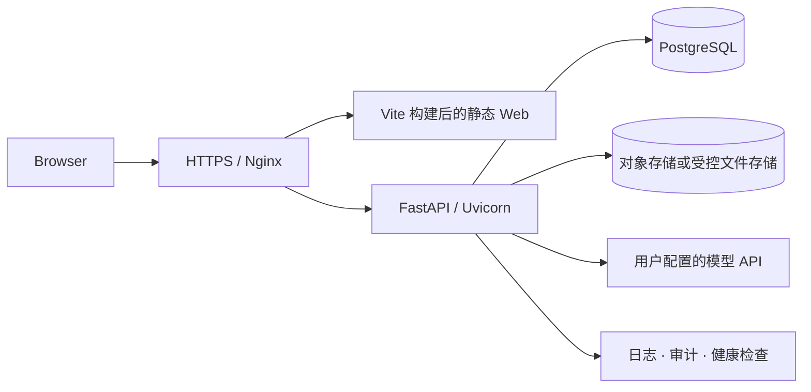

# SPIP V1 部署说明

> 当前为上线准备文档。完整命令、镜像和环境变量模板将在 `v1.0.0` 源代码发布时锁定。

## 推荐拓扑



## 基础环境建议

- Ubuntu 22.04 LTS 或更新的受支持版本
- CPU、内存和系统盘容量应根据并发、文件类型和模型调用方式压测确定
- 文件成果建议使用对象存储，不长期占用应用服务器系统盘
- PostgreSQL 16
- Python 与 Node.js 版本以正式 Release 锁定文件为准
- Nginx、TLS 证书、systemd 或容器编排
- 建议配置 Swap、自动备份、日志轮转和磁盘告警

图片、视频和大文件不应长期经应用服务器直接中转；建议根据实际流量接入对象存储和 CDN。

## 环境变量原则

正式变量名称将在 `.env.example` 中提供。必须遵守：

- 真实 `.env`、API Key、密码、Token 和证书不得提交 Git；
- 密钥由服务器环境或 Secret Manager 注入；
- 管理员通过一次性 bootstrap 创建，首次登录强制改密；
- 前端不得持有管理员识别码、数据库密码或模型密钥；
- 开发、测试和生产数据库必须隔离。

## 上线顺序

1. 冻结并审计 V1 Git 状态。
2. 扫描源码和完整 Git 历史中的敏感信息。
3. 完成自动测试、生产构建和真实浏览器纵向验收。
4. 核对 Alembic 只有一个 head，并在隔离测试库验证 Migration 往返。
5. 创建数据库、文件存储和旧系统备份，验证可恢复性。
6. 创建 `v1.0.0` Tag 和 GitHub Release。
7. 从 Tag 构建并部署，不从开发工作树直接复制。
8. 执行 Migration 前向升级，禁止手工修改生产数据库。
9. 启动 API 和 Web，配置 Nginx 与 HTTPS。
10. 完成健康检查、权限检查、真实业务烟测和刷新恢复。

## 必须通过的健康检查

```text
GET /login
GET /health
GET /api/v1/health
GET /api/v1/database/health
```

同时验证：

- 公开端口只有 80/443/SSH 等明确批准端口；
- API 与数据库不直接暴露公网；
- 前后端进程唯一且可由进程管理器恢复；
- 登录、Workspace、附件、成果下载和刷新恢复正常；
- 普通用户无法访问系统管理后台；
- 外部模型失败不会制造伪成功。

## 回退原则

- 部署前保留云主机快照、数据库备份、文件清单和旧服务配置。
- 不直接清空服务器；先确认删除目标、备份有效和回退命令。
- 应用回退使用上一稳定 Tag；数据库只使用经过验证的恢复方案。
- Migration downgrade 只在独立环境验证，不在生产故障中盲目执行。

## 云服务器部署前检查

无论使用腾讯云或其他云平台，正式部署前都需完成实例快照、旧配置盘点、数据库与对象存储方案、SSH 密钥、密码轮换、Swap、TLS、防火墙和监控配置。服务器地址、账号、现有服务状态和内部拓扑不得写入公开仓库。
